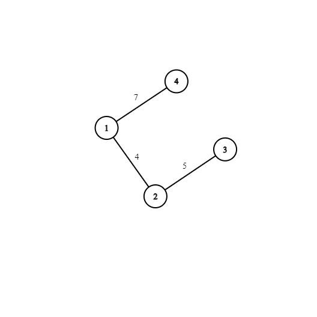
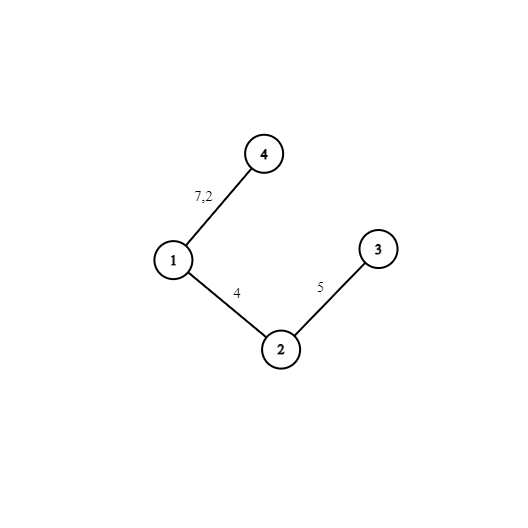
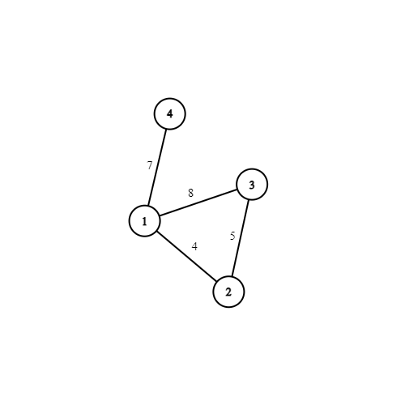

## MST Queries

//Add comparator notes

You have a weighted undirected connected graph with $N$ vertices and $M$ edges. The vertices are labeled as Vertex $1$, Vertex $2$, $\dots$, Vertex $N$. The edges are labeled as Edge $1$, Edge $2$, …, Edge $M$. Edge $i$ connects Vertex $x_i$ and $y_i$ and has a weight of $c_i$. All the weight in the graph is **unique**.

You have to process the $Q$ queries explained below.
The $i$-th query gives a triple of integers $(a_i,b_i,w_i)$. Here, $w_i \neq c_j$ for all $j$.
Let $e_i$ be an undirected edge that connects Vertex $a_i$ and Vertex $b_i$ and has a weight of $w_i$. Let's say we add the edge $e_i$ to the current graph and then find the minimum spanning tree of the newly formed graph. You have to determine if the edge $e_i$ is present in the minimum spanning tree.

**Queries are independent of each other. It means even though Query $i$ considers the graph obtained by adding $e_i$ to graph, the graph in other queries does not have $e_i$**

### Constraints

$2 \leq N \leq 10^{5}$
$N-1 \leq M \leq 10^{5}$
$1 \leq x_i \leq N$
$1 \leq y_i \leq N$
$1 \leq c_i \leq 10^{7}$
$1 \leq Q \leq 10^{5}$
$2 \leq a_i \leq 10^{5}$
$2 \leq b_i \leq 10^{5}$
$1 \leq w_i \leq 10^{7}$
All $c_i$ are unique
All $w_i$ are unique
$w_i \neq c_j$ form all $i$ and $j$

### Input

$N \quad M \quad Q$
$x_1 \quad y_1 \quad c_1$
$x_2 \quad y_2 \quad c_2$
$\vdots$
$x_M \quad y_M \quad c_M$
$a_1 \quad b_1 \quad w_1$
$a_2 \quad b_2 \quad w_2$
$\vdots$
$a_Q \quad b_Q \quad w_Q$

### Output

Print $Q$ lines. The $i$-th line should contain the answer to Query $i$: `YES` or `NO`.

### Example

Input

```
4 3 2
1 2 4
2 3 5
1 4 7
4 1 2
1 3 8
```

Output

```
YES
NO
```

- For $1$st case

Graph before adding the edge
</img>

And after adding the edge $(4,1,2)$
</img>

So the MST of this case include the edge $(4,1,2)$

- For $2$nd case

Graph before adding the edge
</img>

And after adding the edge $(4,1,2)$
</img>

So the MST of this case would not include include the edge $(4,1,2)$

### Test cases

**Edge cases**

```
3 3 1
1 3 5
1 2 3
2 3 6
1 1 1

Query edge contains self loof
Output: NO
```

```
3 3 1
1 1 2
1 2 4
2 3 6
1 3 5

Graph contains self loop
Output: NO
```

```
3 4 1
1 2 3
2 3 5
3 1 3
1 2 6
1 2 7

Graph contains multiple edges
Output: NO
```

### Hints

- Which algorithm is used for finding minimum spanning tree?
- Can you solve this problem in $O(Q*N\log{N})$?
- Notice that we are not adding the query edge to the graph, so it has no effect on the final MST.
- An edge between vertices $x$ and $y$ will only be present in MST if $x$ and $y$ are not connected.
- Does the order of queries matter, or we can change it? If so can you change the order to optimize the solution?

### Editorial

**Prerequisites**

- Kruskal's Algorithm
- Disjoint Set Union data structure

**Optimal Solution $O((Q+N)\log{N})$**

Let's briefly discuss Kruskal's algorithm to find MST.

- Sort the edges by their weight in increasing order
- If Vertices $x$ and $y$ are connected in the UnionFind then there already is an optimal path between vertices.
- If Vertices $x$ and $y$ are not connected in the Union Find, we decide to use this edge. Then we connect $x$ and $y$ in the UnionFind. This is always optimal because we have sorted edges in increasing order of weight, so we always select the optimal weight first.
- We repeat the process until all vertices are connected.

We can repeat the same process for each $Q$ queries and check if $e_i$ edge is present in MST or not. However, this process is too slow.

Here we make two observations

- We can observe that we may abort the algorithm once we inspect $e_i$, as we only want to answer the query.
- Query edges do not affect the UnionFind data structure but the graph edges do.

Thus, the algorithm above can be parallelized; i.e. all the query computations can be processed in parallel. (_Check the algorithm below to have a clear understanding_).

- We add all the graph and query edges together and sort them in increasing order of their weights.

- If the current edge is a query edge

  - If Vertices $x$ and $y$ are unconnected, then the answer for current query would be `YES` else it would be `NO`

- If the current edge is a graph edge
  - If Vertices $x$ and $y$ are not connected in the UnionFind, we decide to use this edge. Connect $x$ and $y$ in the UnionFind.
  - If Vertices $x$ and $y$ are connected in the UnionFind, do nothing;

**Time complexity :** $O((N+Q)\log{N})$
**Space complexity :** $O(M+Q)$

**Resource links**

- [Disjoint set implementation](https://cp-algorithms.com/data_structures/disjoint_set_union.html)
- [Kruskal's Algorithm](https://cp-algorithms.com/graph/mst_kruskal.html)
- [Comparator in C++](https://www.youtube.com/watch?v=3pvZhwp0U9w)

  **Related problems**

- [Sum of edge weights in MST](https://practice.geeksforgeeks.org/problems/minimum-spanning-tree/1)
- [Learning Languages (DSU)](https://codeforces.com/contest/277/problem/A)
- [Ice skating (DSU)](https://codeforces.com/problemset/problem/217/A)
- [Bertown Subway (DSU)](https://codeforces.com/contest/884/problem/C)

### Code

```cpp
#include <bits/stdc++.h>


using namespace std;


/***
* Implementation for disjoin set union
* It implements Path compression and union by rank
* Check the resource link to understand the implementation
*/
struct Dsu
{
	vector<int> par;
	vector<int> rank;

	Dsu(int size)
	{
		par.resize(size);
		rank.assign(size , 1);
		iota(begin(par), end(par) , 0);
	}

	int findParent(int node) {
		if (node == par[node]) return node;
		return par[node] = findParent(par[node]);
	}

	bool areConnected(int u, int v) {
		return findParent(u) == findParent(v);
	}

	void mergeVertices(int u , int v)
	{
		u = findParent(u);
		v = findParent(v);

		if (u == v) return;

		if (rank[u] > rank[v])
		{
			par[v] = u;
			rank[u] += rank[v];
		}
		else
		{
			par[u] = v;
			rank[v] += rank[u];
		}
	}
};


struct Edge
{
	int x;
	int y;
	int wt;
	bool isQuery;
	int queryIndex;

    /***
	* We use operator overloading. You can also use comparator to sort edges by
	* weight.
	*/
	bool operator <(Edge other) {
		return wt < other.wt;
	}
};


void findAnswer(vector<Edge>&v , vector<string>& ans , int n) {
	Dsu dsu(n + 1);

	for (auto edge : v) {

		if (edge.isQuery) {
			if (dsu.areConnected(edge.x , edge.y))
				ans[edge.queryIndex] = "NO";
			else
				ans[edge.queryIndex] = "YES";
		} else {
			if (!dsu.areConnected(edge.x, edge.y))
				dsu.mergeVertices(edge.x , edge.y);
		}
	}
}

int main() {


	int n, m, q;
	cin >> n >> m >> q;


	vector<Edge> v(m + q);
	vector<string> ans(q);


	for (int i = 0; i < m; i++) {
		cin >> v[i].x >> v[i].y >> v[i].wt;
		v[i].isQuery = false;
		v[i].queryIndex = -1;
	}

	for (int i = m , j = 0; i < m + q; i++ , j++) {
		cin >> v[i].x >> v[i].y >> v[i].wt;
		v[i].isQuery = true;
		v[i].queryIndex = j;
	}


	sort(begin(v), end(v));

	findAnswer(v, ans, n);


	for (int i = 0; i < q; i++)
		cout << ans[i] << "\n";

	return 0;
}
```
