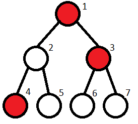

## Risky path

You are given a tree with $n$ vertices and $n-1$ edges. Each node is marked either dangerous(marked as $1$) or not dangerous(marked as $0$).
You are currently on the vertex number $1$ and you want to travel to any of the leaf nodes. However, you do not want to travel through a path which contains more than $m$ consecutive dangerous node.

So you need to find the number of path from root to leaf where number of consecutive dangerous nodes is less than $m$.

### Constraints

$2 \leq n \leq 10^5$
$a_i = 0 \  , \ 1$
$1 \leq x_i,y_i \leq n$

### Input

$n$
$a_1 \quad a_2 \quad a_3 \quad \dots \quad a_n$
$x_1 \quad y_1$
$x_1 \quad y_1$
$\vdots$
$x_M \quad y_M$

### Output

Print one integer, the number of safe paths from root to leaves.

### Example

Input

```
47 1
1 0 1 1 0 0 0
1 2
1 3
2 4
2 5
3 6
3 7
```

Output

```
2
```

Explanation:



Let's consider all the paths

- $1 \to 2 \to 4$. Number of consecutive danger nodes are $\leq$ 1. So it is possible.
- $1 \to 2 \to 5$. Number of consecutive danger nodes are $\leq$ 1. So it is possible.
- $1 \to 3 \to 6$. Number of consecutive danger nodes are $>$ 1. So it is not possible.
- $1 \to 3 \to 7$. Number of consecutive danger nodes are $>$ 1. So it is not possible.

Therefore, number of valid paths = $2$

### Test cases

**Edge cases**

```
2 1
1 1
1 2

Output: 0
```

```
2 0
1 1
1 2

Output: 1
```

```
2 1
0 1
1 2

Output: 1
```

```
4 1
1 1 0 0
1 2
1 3
1 4

Output: 2
```

### Hints

- Notice that a tree does not have multiple edges or loops.
- If all the nodes are assumed to be not dangerous then how many paths are there from leaf to nodes? (Is it equal to the number of leaves)
- Can we solve this problem using DFS?

### Editorial

**Prerequisites**

- Basic DFS

**Optimal Solution**

First let's have a look at two important observation

- A tree does not have any loops or multiple edges.
- Shortest path between any two nodes is always unique.

So the number of paths from root to leaves = number of leaves.

Now we need to calculate the valid paths. We can go down the tree from the root, supporting additional parameter $count$ — the number of dangerous nodes in a row. If $k$ exceeds $m$, then we won't proceed further. Then the answer is the number of leaves, which we were able to reach.

**Time complexity :**$O(N)$

**Space complexity :**$O(N)$

**Resource links**

- [DFS](https://www.geeksforgeeks.org/depth-first-search-or-dfs-for-a-graph/)

### Code

```cpp
#include <bits/stdc++.h>

using namespace std;

int n, m;
vector<vector<int>> tree;
vector<int> dangerous;

int ans = 0;

void dfs(int v , int parent, int count) {


	if (dangerous[v] == 1) count++;
	else count = 0;
	if (count > m) return;

	bool isLeaf = true;

	for (int to : tree[v]) {
		if (to == parent) continue;

		isLeaf = false;
		dfs(to, v, count);
	}

	if (isLeaf)
		ans++;

}

void input() {
	int x, y;

	cin >> n >> m;
	tree.resize(n + 1);
	dangerous.resize(n + 1);

	for (int i = 1; i <= n; i++)
		cin >> dangerous[i];


	for (int i = 0; i < n - 1; i++) {
		cin >> x >> y;
		tree[x].push_back(y);
		tree[y].push_back(x);
	}

}

int main() {

	input();
	dfs(1, -1, 0);

	cout << ans << "\n";
	return 0;
}

```
