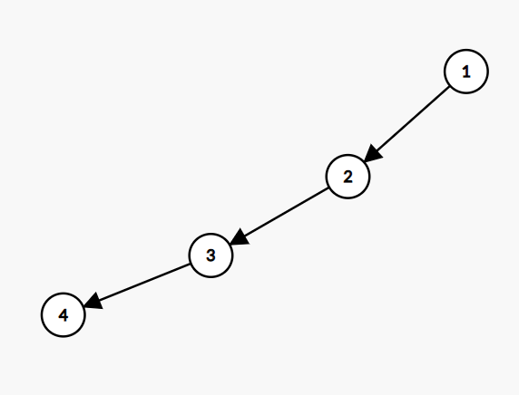
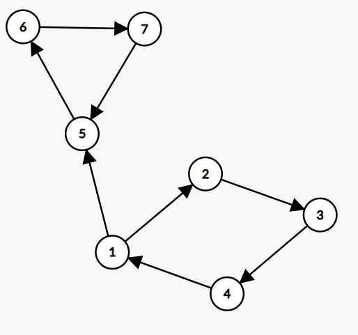

## Ways to make a valid graph

You are given a graph with $N$ nodes and $M$ bidirectional edges. But we want to convert the graph into a directed graph (edges must be unidirectional). Also, we want to fulfil a condition that the _outdegree of each node must be 1_.

**Outdegree**: Number of edges pointing away from the node.

Find the number of possible ways to convert the graph modulo ${10}^9\ +\ 7$.

If it is not possible to make a valid graph print $-1$.

### Constraints

$2\le N\le{10}^5$
$1\le M\le{10}^5$
$1\le\ a_i,\ \ b_i\ \le N$

### Input

$N\ \ \ \ M$
$a_{1\ \ \ \ \ }b_1$
$a_{2\ \ \ \ \ }b_2$
$\vdots$
$a_{M\ \ \ \ \ }b_M$

### Output

Print the number of ways to make valid graph modulo ${10}^9\ +\ 7$.

### Example

Input

```
3 3
1 2
1 3
2 3
```

Output

```
2
```

Two ways to make graph valid are

$1→2 , 2→3 , 1←3$
$1←2 , 2←3 , 1→3$

### Test cases

**Edge cases**

- ```
    6 7
    1 2
    2 3
    4 3
    1 4
    2 5
    5 6

    Expected output: -1
  ```

- ```
    2 1
    1 2

    Expected output: -1
  ```

**Large input test cases**

- ```
    9999 9999
  1 2
  2 3
  1 3
  4 5
  5 6
  6 4
  ...
  (Make cycles of 3 nodes for all values of n)
  ```

### Hints

- Try drawing a graph in which outdegree of each node is $1$.
- Does the graph being connected or disconnected has an effect on answer
- Okay so if only cycles can be converted to valid graph and I give you number of cycles then can you find the answer ?

### Editorial

**Prerequisites**

- Basic graph theory
  - BFS/DFS
  - Connected Components
  - Cycle detection
- Basic Number theory
  - Binary exponentiation

**Optimal Solution $O(N+M)$**

Let us look at a few cases

- **If any connected has no then it is not possible to convert the graph.**
  **Reason**: In any acyclic graph there is at least one node which has not outgoing edge. So, it cannot be converted to a valid graph

  <br />

  

  Node $4$ has outdegree of $0$. (No matter how we change the graph it will never be valid. You can try out different examples).

- **If any connected has more than 1 cycle then it cannot be converted to a valid graph.**
  **Reason**: In this case at least one node will have an outdegree of greater than 1.

  <br />

  

  Here node 1 has an outdegree of 2. So, it is invalid

- **A connected component can be converted if it has only 1 cycle. And there is exactly 2 ways to convert it to valid graph i.e., either in clockwise or anticlockwise direction.**
  Reason: For outdegree to be 1 for each node we must obtain a cycle hence it can only be clockwise or anticlockwise.

So, considering each connected component is valid the number of ways to convert graph will be: $2^{\left(number\   of \ connected \ components\right)}$
Else the answer will be $-1$.

Algorithm to find the cycle in a component:

- We can find if there is a cycle using simple DFS
- If a node is not visited then we visit the node
- If a node is visited then we check the vis[] value. If the vis[] is 1, and it is not the parent of current node that means we have already visited node in our path and hence a cycle is found.
- Once we are done with a node, we want to mark the node, that we don’t consider it again.

  _(You can check the code for clarification)_

DFS takes at most $O(N+M)$ and binary exponentiation takes at most $O(\log{n})$. Therefore

**Time Complexity :** $O(N+M)$
**Space Complexity :** $O(N+M)$

**Things to keep in mind**

- Whenever you have problem based on graph always ask the interviewer if the graph has multiple edges or self loops as these might have to handled separately.

**Resource links**

- [DFS](https://www.youtube.com/watch?v=rEa4014IxR8&list=PL2q4fbVm1Ik6DCzm9XZJbNwyHtHGclcEh&index=3)
- [Cycle detection](https://www.youtube.com/watch?v=eCG3T1m7rFY&list=PL2q4fbVm1Ik6DCzm9XZJbNwyHtHGclcEh&index=11)
- [Connected Compnents](https://www.youtube.com/watch?v=z49Ohr5Ypnw&list=PL2q4fbVm1Ik6DCzm9XZJbNwyHtHGclcEh&index=4)
- [Binary Exponentiation](https://www.youtube.com/watch?v=K8mJ27S72v0)
- [Easy graph theory](https://www.youtube.com/watch?v=VW85xQ6GJP4&list=PL2q4fbVm1Ik6DCzm9XZJbNwyHtHGclcEh)
- [Intermmediate-hard graph theory](https://cp-algorithms.com/#graphs)

**Related problems**

- [Connected components](https://www.hackerearth.com/problem/algorithm/connected-components-in-a-graph/)
- [Cycle detection](https://www.interviewbit.com/problems/cycle-in-undirected-graph/)
- [Binary exponentiation](https://leetcode.com/problems/powx-n/)

### Code

```cpp
#include <bits/stdc++.h>

using namespace std;

const int MOD = 1e9 + 7;

vector<int>	graph[100001];
vector<int> vis(100001 , 0);
int n , m, a, b;

/**
* This is code for binary exponentiation
* However the constraints can allow linear exponentiation
*/
int mod_pow(int a, int b, int mod) {
	int result = 1;

	while (b > 0) {
		if (b & 1) result = 1LL * result * a % mod;
		a = 1LL * a * a % mod;
		b >>= 1;
	}

	if (result < 0) result += MOD;

	return result;
}


void inputGraph() {
	cin >> n >> m;

	for (int i = 0; i < m; i++) {
		cin >> a >> b;
		graph[a].push_back(b);
		graph[b].push_back(a);
	}
}

/**
* vis[] stores two values 1 and 2
* vis[v] = 1 means we have visited the node and we want to check wether this node is present in any cycle
* vis[v] = 2 means we have visited the node and we dont want to wether is is present in cycle or not
*/

void countCycles(int v, int par , int& num_of_cycles) {
	vis[v] = 1;

	for (int to : graph[v]) {
		if (!vis[to])
			countCycles(to, v , num_of_cycles);
		else if (vis[to] == 1 && to != par)
			num_of_cycles++;
	}

	vis[v] = 2;

}


int count_valid_components() {

	bool isValidGraph = true;
	int num_of_components = 0;

	for (int i = 1; i <= n; i++) {
		if (vis[i] != 0) continue; // We have visited this component so we skip it

		int num_of_cycles = 0;

		countCycles(i, -1 , num_of_cycles);

		if (num_of_cycles == 0  || num_of_cycles > 1) {
			isValidGraph = false;
			break;
		} else num_of_components++;

	}


	if (!isValidGraph || num_of_components == 0) return 0;
	return num_of_components;
}


int main() {


	inputGraph();
	int num_of_valid_components = count_valid_components();

	if (num_of_valid_components == 0) {
		cout << -1 << "\n";
		return 0;
	}


	cout << mod_pow(2 , num_of_valid_components, MOD) << "\n";

	return 0;
}

```
