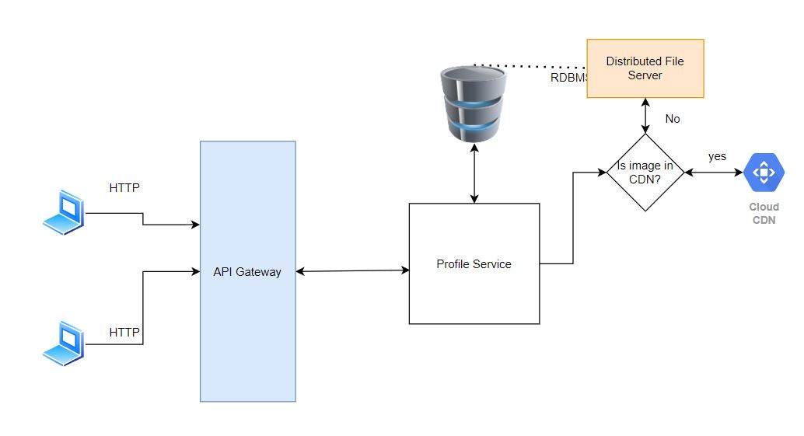
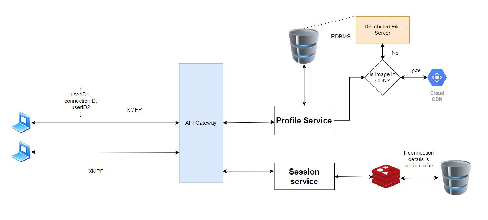
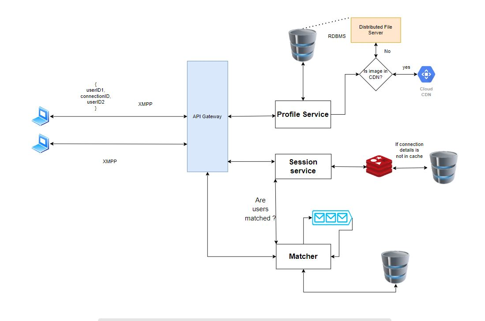
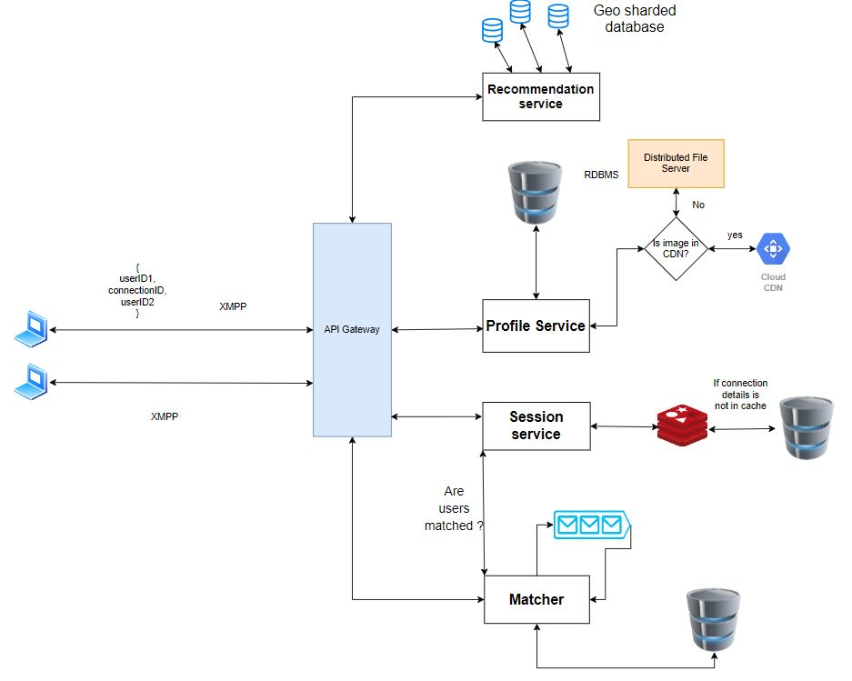
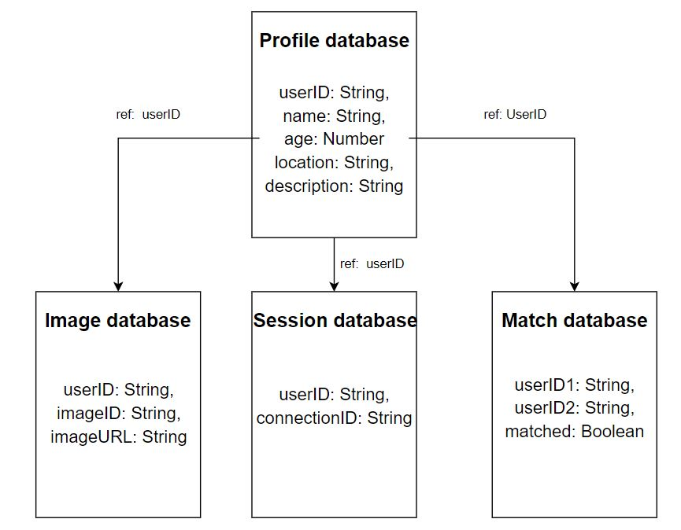

## High Level Design for Tinder

### Requirements

##### Prioritized requirements

- System should store all the relevant profile data like name, age, location and **profile images**.
- Users should be **recommended matches** based on their previous choices.
- System should **store the details when a match occurs**.
- System should **allow for direct messaging between two users if they have matches**.

##### Requirements not a part of our design

- Allowing moderators to remove profile.
- Payment and subscriptions for extra features.
- Allowing only limited number of swipes to users without subscription

### Estimation

- We will store **5 profile images per users.**
- We are assuming the **number of active user is 10 million.**
- We are assuming the **number of matches is $0.1\%$ of total active users i.e., $1000$ matches daily.**

### Requirement 1: Profile creation, authentication and storage

#### Description

First the system should allow a new user to create an account and once the account has been created then it needs to provide the user with an authentication token. This token will be used by the API gateway to validate the user.

System needs to store profile name, age, location and description in a relational database. However, there are $2$ ways to store images.

- We can store images as file in File systems.
- We can store images as BLOB in databases.

#### Components required

- **API Gateway Service**

  - It will balance load across all the instances.
  - It will interact with all the services
  - It will also validate authentication token of the users
  - It will redirect users to the required service as per their request.

- **Distributed File System to store images**

  - We will use CDN to serve the static images faster.

- **Relational database to store user information**

  - We will store the user ID, name, age, location, gender, description, (user preferences) etc.

#### Trade-offs

- **Storing images as File v/s Storing images as BLOB**

  - **Features provided by database when store images as BLOB**

    - **Mutability :** When we store an image as a BLOB in database we can change its value. However, this is useless as because an update on image is not going to be a few bits. We can simply create a new image file.

    - **Transaction guarantee :** We are not going to do an atomic operation on the image. So this feature is useless.

    - **Indexes :** We are not going to search image by its content (which is just 0's and 1's) so, this is useless.

    - **Access control :** Storing images as BLOB's in database provides us access control, but we can achieve the same mechanisms using the file system.

  - **Features provided by file system when store images as files**

    - They are comparatively cheap.

    - They are comparatively faster because they store large files separately.
    - Files are static, so we can use CDN for faster access.

  So for storing user images we will use **Distributed File System**

#### Diagram

### Requirement 2: One to one Chat messaging

#### Description

System should allow one to one chat messaging between two users if and only if they have matched. So we have to connect one client to another.

To achieve this we use XMPP protocol that allows peer to peer communication.

#### Components required

- **Relational database**

  - We will use this database to store the user ID and connection ID

- **[Extra] Cache**
  - We do not want to access database every time a client sends a message, so we can use a cache to store the user ID and connection ID.
  - We will use LRU caching scheme to remove the least recently used connection from cache.

#### Trade-offs

- Use of HTTP for chat v/s Use of XMPP for one to one messaging
  - When we use HTTP XMPP we can only message from client to server. The only way we can allow messaging is by constantly sending request to server to check if there is any new message (polling).
  - XMPP is a peer to peer protocol that allows client and server to send messages to each other.
  - As we do not need to constantly send requests to sever, using **XMPP will be more efficient**.

#### Diagram

### Requirement 3: Matching right swiped user

#### Description

Server should store the following information

- Users who have matched (both have right swiped each other)
- One or both the users have left swiped each other.

This service would also allow the chat service to check if the users are matched and then allow one to one chat messaging.

#### Components required

- **Relational database**

  - We will use this database to store the user IDs of both the user
  - We will use indexes on the user ID to make queries faster.

- **[Extra] Message queue**
  - When there are a lot of users submitting request then we can message queue.
  - When we receive a request we acknowledge the user that the request has been submitted, and we push the event to the message queue which can be processed later.

#### Trade-offs

- **Storing match details on the client v/s Storing match details on the server**

  - One benefit of storing the match details on the client we save storage on the
    server side. However, as we are storing only the user IDs it is not significant.
  - If we store match data on client side then all data is lost when user uninstalls the applications but if we store it on the server then the data is not lost.
  - Benefit of storing the details on the server side is that it becomes a source of truth. And as the details on the server cannot be tampered so, it is more secure.
  - **So we store the relevant details on the server side**

- **[Extra] Rate limiting v/s message queue when there are a lot of requests**
  - One disadvantage of using rate limiting is that even after the user has swiped right, if there are a lot of requests then this request will be dropped by the server and the user has to right swipe again. This causes a bad user experience.
  - Advantage of using a message queue is that even if there are a lot of requests we can push it to the queue and acknowledge the user that we have received the requests, and it can be processed later, so the user does not have to right swipe again.
  - **Hence, we should use message queue here.**

#### Diagram

### Requirement 4: Server recommendations to users

#### Description

Server should be able to recommend profiles to users. These recommendations should take into consideration the age and gender preferences.
Server should also be able to recommend profiles that are geographically close to the user.

#### Components required

- **Relational database**
  - We can do horizontal partitioning (sharding) on the database based on the location. Also, we can put indexes on the name and age, so we can do efficient query processing.
  - For every database partition we will have a master slave architecture. This will allow the application to work even if the primary database fails.

#### Diagram

### Database design

### API Design

##### Profile service

- **POST /user/signup** - Creates new account
- **GET /user/login** - Sends the user authentication token
- **GET /user/:userID** - Gets the profile of the user ID
- **PUT /user/:userID** - Update user details
- **DELETE /user/:userID** - Removes the user account

##### Session service

- **GET /session/users/:connectionID** - Returns both the users that have the connection ID.
- **DELETE /session/connection/:connectionID** - Deletes all the data that have the connection ID.
- **POST /session/connection/:userID1/:userID2** - Adds user ID1 and user ID2 with the same connection ID.

##### Matcher service

- **GET /match** - Return all the matches of the logged-in user.
- **DELETE /match/:userID** - Deletes the user ID from the match list.

##### Recommendation service

- **GET /recommendation** - Returns a collection of most appropriate profiles for logged-in user.
